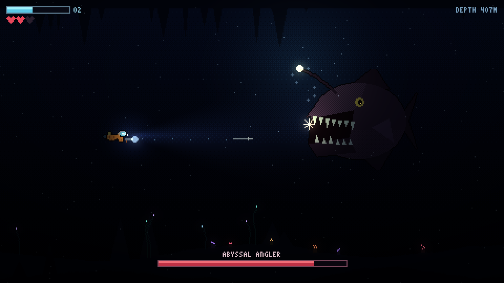

# Sub-Antarctic 🤿

심해 탐험 액션 도트게임 — 잠수하고, 채집하고, **살아서 돌아와라**.

**▶ 플레이: https://sub-antarctic.vercel.app** (데스크톱 + 모바일)



## 게임

- 관성 있는 **자유 유영** + 헤드램프로 어둠을 밝히며 탐험
- **작살총**으로 심해 생물과 전투 — 해파리, 매복하는 곰치, 그리고 **불빛에 이끌리는** 심해어 떼
- 크리스탈을 캐고 **살아서 거점에 복귀해야만 획득 확정** — 죽으면 들고 있던 것을 전부 잃는다
- O2는 계속 줄어든다. 더 깊이 갈까, 지금 돌아갈까
- 최심부의 보스 **ABYSSAL ANGLER** — 체력 50% 이하에서 조명이 꺼진다

## 조작

| | 데스크톱 | 모바일 |
|---|---|---|
| 유영 | WASD / 방향키 | 왼쪽 가상 스틱 |
| 조준·발사 | 마우스 / 클릭 | 오른쪽 가상 스틱 (기울이면 자동 발사) |
| 부스트 | Shift | 왼쪽 스틱 최대 기울기 |

## 기술

- 순수 JS (ES 모듈) + Canvas 2D — **빌드 도구·외부 의존성 0**
- 내부 해상도 480×270 (기기 비율 따라 ~640 확장), nearest-neighbor 업스케일
- 실시간 라이트맵 (multiply 합성): 깊이 앰비언트 + 헤드램프 원뿔 + 발광 생물
- 모든 스프라이트 프로시저럴 생성 (외부 애셋 0)
- 로직은 캔버스 없이 단위 테스트: `npm test`

## 로컬 실행

```bash
python -m http.server 8000   # 또는 아무 정적 서버
# http://localhost:8000
```

## 문서

- 설계 스펙: [docs/superpowers/specs/](docs/superpowers/specs/)
- 구현 계획: [docs/superpowers/plans/](docs/superpowers/plans/)
